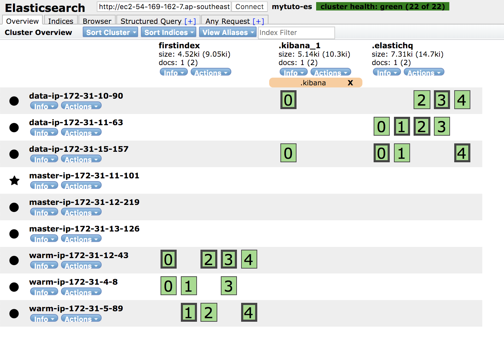

# ES-Tutorial-4-2

ElasticSearch 4-2 번째 튜토리얼을 기술합니다.

본 스크립트는 외부 공인망을 기준으로 작성되었습니다.

## Product 별 버전 상세
```
Product Version. 6.6.0(2019/02/07 기준 Latest Ver.)
```
* [Elasticsearch](https://artifacts.elastic.co/downloads/elasticsearch/elasticsearch-6.6.0.rpm)
* [Kibana](https://artifacts.elastic.co/downloads/kibana/kibana-6.6.0-x86_64.rpm)

최신 버전은 [Elasticsearch 공식 홈페이지](https://www.elastic.co/downloads) 에서 다운로드 가능합니다.

## ElasticSearch Product 설치

이 튜토리얼에서는 rpm 파일을 이용하여 실습합니다.

```bash
[ec2-user@ip-xxx-xxx-xxx-xxx ~]$ sudo yum -y install git

[ec2-user@ip-xxx-xxx-xxx-xxx ~]$ git clone https://github.com/benjamin-btn/ES-Tutorial-4-2.git

[ec2-user@ip-xxx-xxx-xxx-xxx ~]$ cd ES-Tutorial-4-2

[ec2-user@ip-xxx-xxx-xxx-xxx ES-Tutorial-4-2]$ ./tuto4-2
##################### Menu ##############
 $ ./tuto4-2 [Command]
#####################%%%%%%##############
         1 : install java & elasticsearch packages
         2 : configure elasticsearch.yml & jvm.options
         3 : start elasticsearch process
         4 : hot/warm template settings
         5 : all indices move to hotdata node
         6 : specific index moves to warmdata node
#########################################

```

## ELK Tutorial 4-2 - Elasticsearch Warm Data Node 추가

### Elasticsearch
##### /etc/elasticsearch/elasticsearch.yml

1) cluster.name, node.name, http.cors.enabled, http.cors.allow-origin 기존장비와 동일 설정
2) network.host 를 network.bind_host 와 network.publish_host 로 분리, 기존장비와 동일 설정
3) http.port, transport.tcp.port 기존장비와 동일 설정

```bash
[ec2-user@ip-xxx-xxx-xxx-xxx ES-Tutorial-4-2]$ ./tuto4-2 1

[ec2-user@ip-xxx-xxx-xxx-xxx ES-Tutorial-4-2]$ ./tuto4-2 2

[ec2-user@ip-xxx-xxx-xxx-xxx ES-Tutorial-4-2]$ sudo vi /etc/elasticsearch/elasticsearch.yml


### For ClusterName & Node Name
cluster.name: mytuto-es
node.name: warm-ip-172-31-13-110

### For Head
http.cors.enabled: true
http.cors.allow-origin: "*"

### For Response by External Request
network.bind_host: 0.0.0.0
network.publish_host: {IP}

### ES Port Settings
http.port: 9200
transport.tcp.port: 9300

```

4) node.master: false, node.data:true 로 role 동일 설정
5) discovery.zen.minimum_master_nodes 기존장비와 동일 설정
6) **discovery.zen.ping.unicast.hosts 는 직접 수정 필요, 기존에 설정한 마스터 노드 3대만 설정(데이터노드 아이피 설정 금지)**
7) **./tuto4-2 1 ./tuto4-2 2 실행 후 discovery.zen.ping.unicast.hosts 에 기존 장비와 추가했던 노드 3대의 ip:9300 설정 필요**

```bash
### ES Node Role Settings
node.master: false
node.data: true

### Discovery Settings
discovery.zen.minimum_master_nodes: 2
discovery.zen.ping.unicast.hosts: [  "{IP1}:9300",  "{IP2}:9300",  "{IP3}:9300",  ]

```

8) **warm data node 임을 클러스터에서 인식할 수 있도록 node.attr.box_type: warm 추가 설정**

```bash
### Hot / Warm Data Node Settings
node.attr.box_type: warm

```

##### /etc/elasticsearch/jvm.options
9) Xms1g, Xmx1g 를 물리 메모리의 절반으로 수정

```bash
[ec2-user@ip-xxx-xxx-xxx-xxx ES-Tutorial-4-2]$ sudo vi /etc/elasticsearch/jvm.options


-Xms4g
-Xmx4g

```

10) 두 파일 모두 수정이 완료되었으면 추가할 노드 3대에서 스크립트 3번을 실행하여 ES 프로세스 시작, 클러스터에 잘 조인되는지 확인

```bash
[ec2-user@ip-xxx-xxx-xxx-xxx ES-Tutorial-4-2]$ ./tuto4-2 3

```

11) **클러스터에 warm data node 3대가 정상적으로 추가되면 기존 데이터노드 3대에 node.attr.box_type: hot 설정 후 한 대씩 프로세스 재시작, 클러스터에서 hot data node 임을 인식할 수 있도록 추가설정**

```bash
[ec2-user@ip-xxx-xxx-xxx-xxx ES-Tutorial-4-1]$ sudo vi /etc/elasticsearch/elasticsearch.yml

### Hot / Warm Data Node Settings
node.attr.box_type: hot

[ec2-user@ip-xxx-xxx-xxx-xxx ES-Tutorial-4-1]$ systemctl restart elasticsearch.service

```

12) 4번 스크립트 실행으로 신규 인덱스는 무조건 hot data node 로 할당될 수 있도록 템플릿 설정

```bash
[ec2-user@ip-xxx-xxx-xxx-xxx ES-Tutorial-4-2]$ ./tuto4-2 4

curl -s -H 'Content-Type: application/json' -XPUT http://localhost:9200/_template/estemplate -d '
{
    "index_patterns": ["*"],
    "order" : 0,
    "settings": {
        "index.routing.allocation.require.box_type" : "hot"
    }
}'

```

13) 클러스터 내 모든 인덱스에 hot box_type 으로 설정

```bash
[ec2-user@ip-xxx-xxx-xxx-xxx ES-Tutorial-4-2]$ ./tuto4-2 5

curl -s -H 'Content-Type: application/json' -XPUT http://localhost:9200/_all/_settings -d '
{
    "index.routing.allocation.require.box_type" : "hot"
}'

```

14) warm data node 로 이동이 필요한 인덱스만 명령을 통해 재할당 진행

```bash
[ec2-user@ip-xxx-xxx-xxx-xxx ES-Tutorial-4-2]$ ./tuto4-2 6 firstindex

curl -s -H 'Content-Type: application/json' -XPUT http://localhost:9200/$1/_settings -d '
{
    "index.routing.allocation.require.box_type" : "warm"
}'

```

이후, curator 를 통해 주기적으로 warm data 에 인덱스를 재할당

## Smoke Test

### Elasticsearch

```bash
[ec2-user@ip-xxx-xxx-xxx-xxx ES-Tutorial-4-2]$ curl localhost:9200
{
  "name" : "warm-ip-172-31-5-89",
  "cluster_name" : "mytuto-es",
  "cluster_uuid" : "LTfRfk3KRLS31kQDROVu9A",
  "version" : {
    "number" : "6.6.0",
    "build_flavor" : "default",
    "build_type" : "rpm",
    "build_hash" : "a9861f4",
    "build_date" : "2019-01-24T11:27:09.439740Z",
    "build_snapshot" : false,
    "lucene_version" : "7.6.0",
    "minimum_wire_compatibility_version" : "5.6.0",
    "minimum_index_compatibility_version" : "5.0.0"
  },
  "tagline" : "You Know, for Search"
}

```

* Web Browser 에 [http://ec2-52-221-155-168.ap-southeast-1.compute.amazonaws.com:9100/index.html?base_uri=http://{FQDN}:9200](http://ec2-52-221-155-168.ap-southeast-1.compute.amazonaws.com:9100/index.html?base_uri=http://FQDN:9200) 실행



## Trouble Shooting

### Elasticsearch
Smoke Test 가 진행되지 않을 때에는 elasticsearch.yml 파일에 기본으로 설정되어있는 로그 디렉토리의 로그를 살펴봅니다.

path.logs: /var/log/elasticsearch 로 설정되어 cluster.name 이 적용된 파일로 만들어 로깅됩니다.

위의 경우에는 /var/log/elasticsearch/mytuto-es.log 에서 확인할 수 있습니다.

```bash
[ec2-user@ip-xxx-xxx-xxx-xxx ES-Tutorial-4-2]$ sudo vi /var/log/elasticsearch/mytuto-es.log
```

